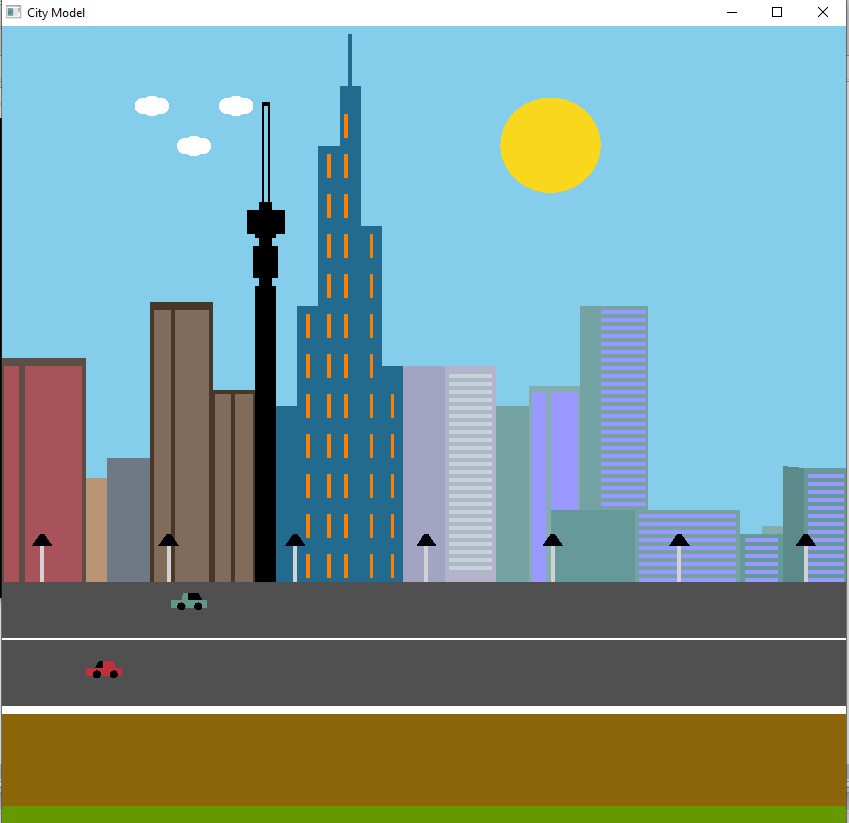

# City Model

## Introduction

This project simulates the model of the city. This city includes objects like buildings,tower, roads,moving car & clouds etc.These objects together comes to form a real like city.In the project building is present in a city model and in the sky couple of clouds will be passing in the sky.Sun will rise and set.There will also 2 lane road with moving car in this project.

## System Implementation Method

 We have used different resources to develop the project. These are:

•	Code Blocks

•	Computer

•	OpenGL primitives

## How can I run this project?
   
   1. Download & Install Codeblocks.
   2. Download & Install Glut.
   3. Create a new glut Project in codeblocks
   4. Go to Github & Copy the main.cpp file from CityModel
   5. And run the project

# Objectives

Design and develop a city view model scenario using OpenGL and glut.

## Features

 Sky 

 Building 

 Tower

 Pillar

 Road

 Road lane

 Roadside lamp light

 Moving Car

 Moving Cloud

 Moving Sun

 Sunrise and sun set

 Roadside grass

 Speed limitations of a car 

## Output :

## Youtube video:
